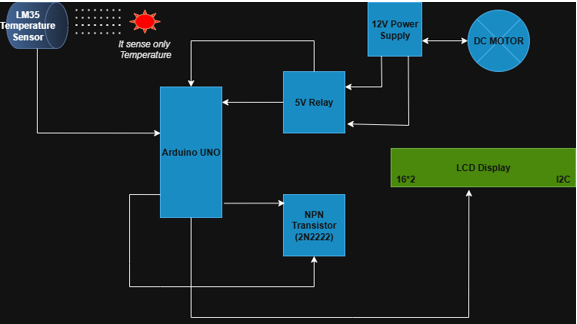

## Theory
A temperature sensor is a device that detects and measures the heat energy of an object or environment. The **LM35** is a precision integrated-circuit sensor that outputs a voltage linearly proportional to the Celsius temperature. Its easy-to-use analog output makes it an ideal sensor for hobbyist projects.
In this project, we are creating an automated control system where temperature serves as the main input.

•	**LM35 Temperature Sensor** : This sensor directly measures the temperature and outputs an analog voltage. This voltage is read by the Arduino's analog pin, which then converts the raw value into a precise temperature reading.

**LM35 Sensor Specifications** : The LM35 has a wide measurement **range of -55°C to +150°C** and an accuracy of **+/- 0.5°C at 25°C**. Its output scale factor is 10mV/°C, meaning for every 1°C increase in temperature, the output voltage rises by **10mV**. The sensor operates on a supply voltage between 4V and 30V, making it perfectly compatible with the Arduino's 5V supply.

To convert the raw sensor value into a real-world temperature reading, a two-step formula is used:

1.	First, the analogRead() function reads a value between 0 and 1023 (representing 0V to 5V). To convert this raw value into a voltage, the following formula is used:
 Voltage = (analogRead(A0) / 1024.0) * 5.0. Here, **1024.0** is the 10-bit resolution of the Arduino's analog-to-digital converter, and **5.0** is the Arduino's operating voltage.

2.	Next, this voltage is converted to a temperature reading in Celsius. Since the LM35 outputs **10 mV** for every **1°C** of temperature, the voltage (in Volts) is simply multiplied by 100 to get the temperature value: Temperature (°C) = Voltage * 100.

•	**Arduino Uno**: This microcontroller acts as the brain of the project. It reads the analog input from the LM35 sensor and processes it according to the program's logic. Based on a set temperature threshold (e.g., 40°C), it decides whether to turn the outputs ON or OFF.

•	**LCD Display**: A 16x2 I2C LCD is used to provide visual feedback. It displays the live temperature reading and the status of the motor and LED, making it easy to monitor the system.

•	**Relay and Transistor**: A 12V DC motor requires more power than the Arduino can provide. This is where a relay is essential. A 5V **relay** is an electromechanical switch that is activated by a small electrical signal. The relay itself is driven by a transistor (like a **2N2222 NPN**), which acts as a current amplifier. This setup allows the Arduino's low-power signal to safely control the high-power motor circuit, providing crucial electrical isolation. To protect the transistor from voltage spikes when the relay turns off, a flyback diode is often used across the relay coil.

**Components Used in this Project**

-	**Microcontroller**: Arduino Uno
-	**Input Device**: LM35 Temperature Sensor
-	**Output Devices**: 12V DC Motor, Red LED, 16x2 LCD Display (I2C)
-	**Interface Components**:
	Relay: 5V Relay Module
	Transistor: 2N2222 NPN Transistor
	Resistors: 220Ω (for LED), 1kΩ (for transistor)
-	**Power Sources**: 12V DC Power Supply and 5V DC Power Supply (from Arduino).

**Microcontroller Connections**

The microcontroller acts as the central control unit, receiving input from the sensor and sending output signals to the devices.
•	**LM35 Sensor**: The LM35 temperature sensor is connected to the A0 analog I/O pin of the Arduino, and the pin is configured as a digital input pin to sense the sensor output as a logic HIGH or logic LOW as per the sensor activation.
•	**LED and Relay**: The output is connected to an NPN transistor to drive the relay, where a +12V DC motor is connected as an output device. Similarly, the RED LED is also connected as an output device.

